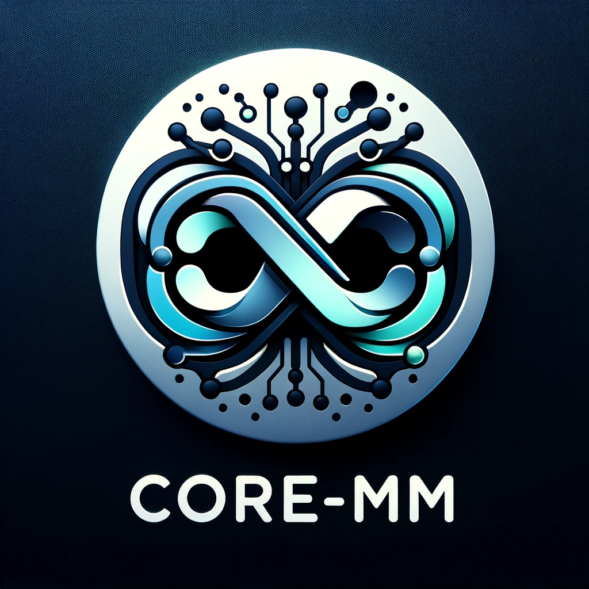
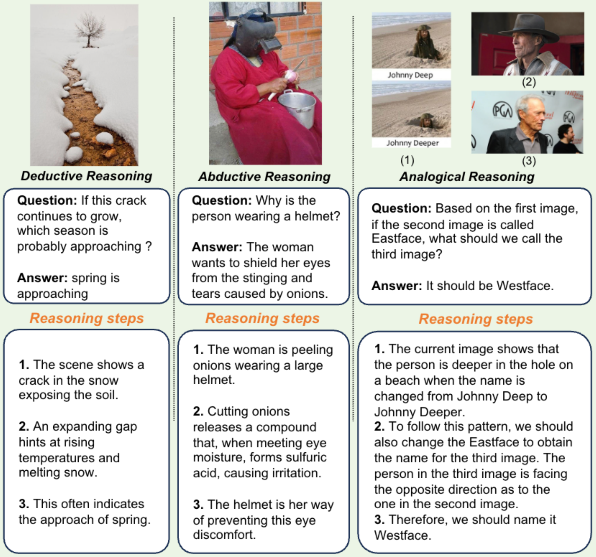
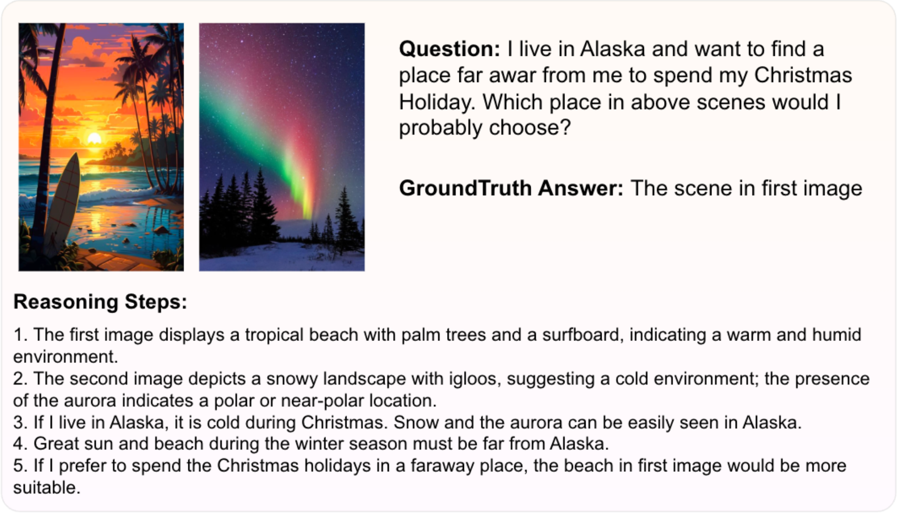
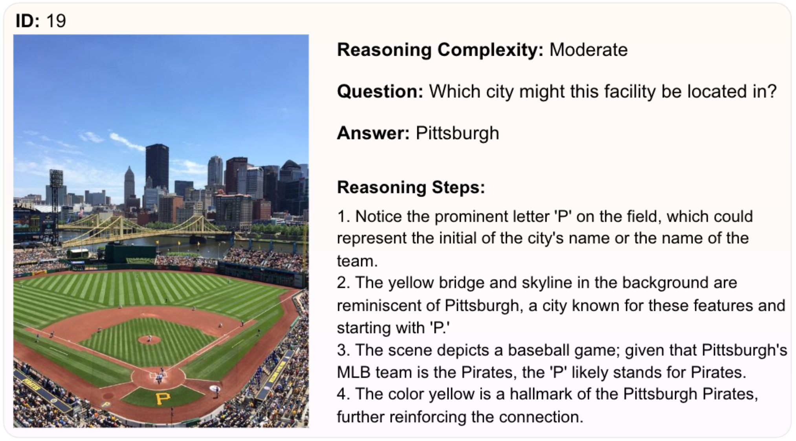
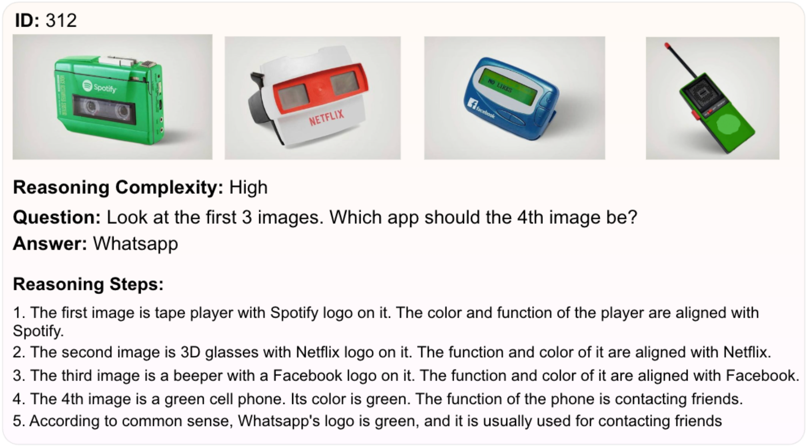
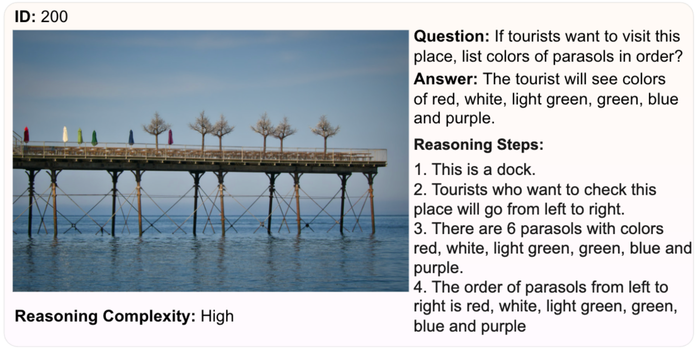
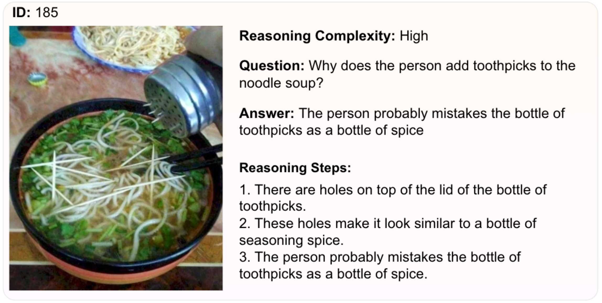

<h1 align="center">
  <br>
  </a>
  <br>
  CORE-MM
  <br>
</h1>

<h4 align="center">
    <a href="https://arxiv.org/abs/2311.11567">
    Complex Open-ended Reasoning Evaluation for Multi-Modal Large Language Models
</h4>

<p align="center">
  <a href="https://arxiv.org/abs/2311.11567">
    
  </a>
  <a href="https://huggingface.co/datasets/Infi-MM/CORE-MM">
    
  </a>
  <a href="https://paperswithcode.com/sota/visual-question-answering-vqa-on-core-mm">
      
  </a>
</p>

<details>
<summary>Table of Contents</summary>

- [News](#news)
- [Leaderboard](#leaderboard)
- [Download](#download)
- [Evaluation](#evaluation)
- [Examples](#examples)
- [Citation](#citation)
- [License](#license)

</details>

<!--  -->

## News

- 🎉 **[2023.11.18]** We release paper at [arxive](https://arxiv.org/abs/2311.11567).

## Leaderboard

The leaderboard can be found via [Papers with Code](https://paperswithcode.com/sota/visual-question-answering-vqa-on-core-mm) or [project page](https://core-mm.github.io/).

## Download

Images and Questions can be downloaded [here](https://huggingface.co/datasets/Infi-MM/CORE-MM).

## Evaluation

To evaluate on our CORE-MM Benchmark, please follow below steps:

### Step 0: [Download Images and Questions](#download)

### Step 1: Generate Response for Your Model

Generate responses for your model on the CORE-MM dataset. The response should be a json file with the following format:

```json
{
  "1": "the answer of question 1",
  "2": "the answer of question 2",
  ...
  "idx": "the answer of question idx"
}
```

### Step 2: Send Predictions to us

After generating responses for your model, please name the json as `model_name_model_size.json` e.g. `CogVLM-Chat_17B.json` and send to us via [email](infimmbytedance@gmail.com) for evaluation.

We will evaluate your model and send you the results back.

## Examples

<p align="center">
     <br>
</p>

<details>
<summary>More examples</summary>







</details>

## Citation

```latex
@misc{han2023coremm,
      title={CORE-MM: Complex Open-Ended Reasoning Evaluation For Multi-Modal Large Language Models},
      author={Xiaotian Han and Quanzeng You and Yongfei Liu and Wentao Chen and Huangjie Zheng and Khalil Mrini and Xudong Lin and Yiqi Wang and Bohan Zhai and Jianbo Yuan and Heng Wang and Hongxia Yang},
      year={2023},
      eprint={2311.11567},
      archivePrefix={arXiv},
      primaryClass={cs.CV}
}
```

## License

<a href="https://creativecommons.org/licenses/by-nc/4.0/deed.en">
	
</a>

This project is licensed under the **CC BY-NC 4.0**.

The copyright of the images belongs to the original authors.

See [LICENSE](LICENSE) for more information.

## Contact

Please feel free to contact us via email [infimmbytedance@gmail.com](infimmbytedance@gmail.com) if you have any questions.

<!-- ## Contributors

[Xiaotian Han](),
[Quanzeng You](),
[Yongfei Liu](),
[Wentao Chen](),
[Huangjie Zheng](),
[Khalil Mrini](),
[Xudong Lin](),
[Yiqi Wang](),
[Bohan Zhai](),
[Jianbo Yuan](),
[Heng Wang](),
[Hongxia Yang]()  -->
